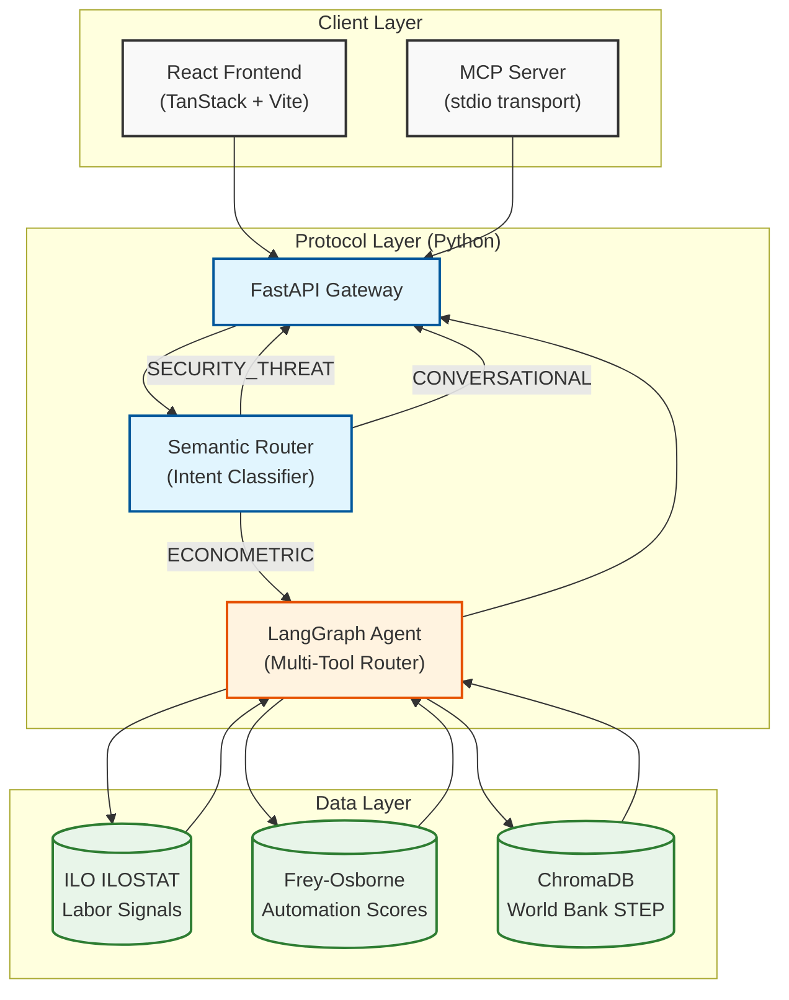

# 🌍 UNMAPPED

AI infrastructure that translates informal labor descriptions into formal economic signals (ISCO-08, automation risk, ILO wage data) — built for the **World Bank FutureWorks Challenge at HackNation 2026**.


## The Problem

~2 billion workers operate in the informal economy. A phone repair technician in Accra has the same core competencies as a certified "Electronics Mechanic" (ISCO-08 code 7421) — but no system recognizes that. Their skills are invisible to employers, governments, and training programs that only speak in formal taxonomies.

UNMAPPED bridges that gap: tell it what you do in your own words, and it returns globally legible credentials, automation risk scores, and real labor market data — at scale, for any region, in any language.

## Architecture



## Tech Stack

| Layer | Technology | Purpose |
|-------|-----------|---------|
| Frontend | React 19, TanStack Router, Vite | Web UI |
| Styling | Tailwind CSS, Radix UI, Framer Motion | Design system |
| Auth | Supabase + Lovable Auth | OAuth (Google/Apple/Microsoft) |
| Deployment | Cloudflare Workers, Docker | Edge hosting + containerization |
| API | FastAPI + Pydantic | HTTP gateway |
| Agent | LangGraph (ReAct) + Groq (LLaMA 3.3 70B) | AI reasoning |
| Classification | LangChain + Groq | Intent triage |
| Embeddings | HuggingFace `all-MiniLM-L6-v2` | Local vector embeddings |
| Vector DB | ChromaDB | RAG retrieval |
| MCP | `mcp` Python SDK (FastMCP) | AI tool protocol (Claude, Cursor, etc.) |
| Testing | pytest + pytest-asyncio | 28 tests, fully mocked |

## Quick Start

```bash
# Backend
pip install -r requirements.txt
uvicorn api:app --reload

# MCP Server (for Claude Desktop, Cursor, etc.)
python mcp_server.py

# Frontend
npm install && npm run dev

# Docker
docker build -t unmapped-protocol .
docker run -p 7860:7860 -e GROQ_API_KEY=your_key unmapped-protocol
```

## Highlights

- Built during the 24-hour Hack-Nation 5th Global AI Hackathon.
- Featured in the official Venture Showcase, where it ranked #1 on the published Venture Showcase list.
- Backend and MCP server functional; semantic router, LangGraph agent, and RAG ingestor fully operational.
- Frontend completed during the hackathon.
- Containerized with Docker and deployable via Cloudflare Workers.

## Documentation

Full technical breakdown → [**ARCHITECTURE.md**](ARCHITECTURE.md)

Covers every component in detail: semantic router logic, LangGraph agent flow, anti-hallucination strategy, MCP protocol deep-dive (transport, tool schemas, client compatibility), RAG pipeline, data flow sequence diagrams, and file map.
